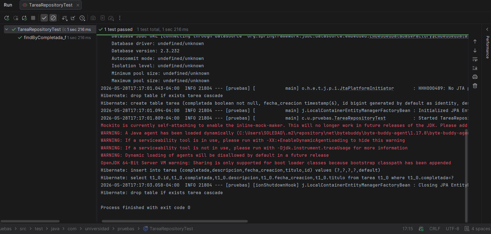
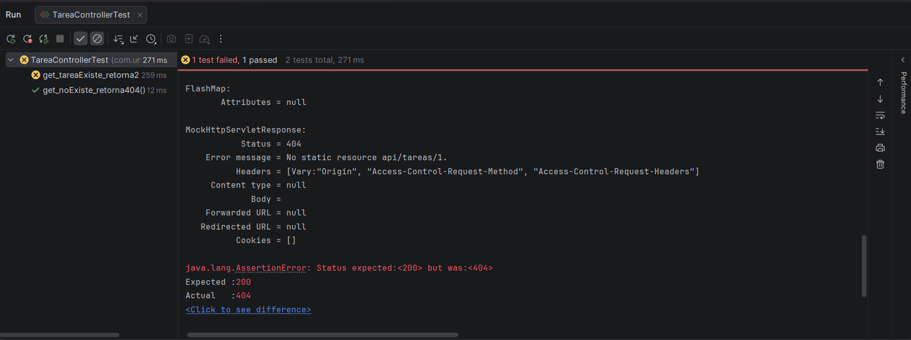

# Proyecto "pruebas"

Este repositorio contiene una pequeña aplicación Spring Boot con pruebas unitarias y de integración y configuración para generar un reporte de cobertura con JaCoCo.

## Requisitos
- Java (en mi entorno se usó Java 25; el proyecto está configurado para compilación a Java 17 en el POM)
- Maven 3.x

Nota: JaCoCo en este proyecto se actualizó a la versión 0.8.13 para soportar clases compiladas con JDK recientes.

## Base de datos para pruebas
Las pruebas usan H2 en memoria para aislar la capa de persistencia. No hace falta configurar nada adicional: Spring Boot junto con las anotaciones de prueba (`@DataJpaTest`, `@SpringBootTest`) inicializan automáticamente una base H2 en memoria durante la ejecución de tests.

Si necesitas una configuración explícita, puedes añadir en `src/main/resources/application.properties` (no es necesario normalmente):

```properties
# ejemplo (no obligatorio)
spring.datasource.url=jdbc:h2:mem:testdb
spring.datasource.driverClassName=org.h2.Driver
spring.datasource.username=sa
spring.datasource.password=
spring.jpa.hibernate.ddl-auto=update
```

## Ejecutar pruebas y generar reporte JaCoCo

1. Ejecutar las pruebas (limpio):

```powershell
mvn clean test
```

2. Generar el reporte JaCoCo (si `jacoco:report` no se ejecutó automáticamente):

```powershell
mvn jacoco:report
```

O en una sola línea (limpia, ejecuta tests y genera reporte):

```powershell
mvn clean test jacoco:report
```

3. Abrir el reporte HTML generado (Windows):

```powershell
start .\target\site\jacoco\index.html
```

La ruta del informe es: `target/site/jacoco/index.html`.

## Estado actual del reporte JaCoCo (captura/resumen)

Después de ejecutar `mvn clean test jacoco:report` en este repositorio el informe generado se encuentra en `target/site/jacoco/index.html`.

Resumen actual (extraído del informe generado en `target/site/jacoco/index.html`):

- Cobertura total (instrucciones): 95% (5 de 113 instrucciones perdidas)
- Cobertura de ramas: 75% (1 de 4 ramas perdidas)

Cobertura por paquete:
- `com.universidad.pruebas.service`: 100%
- `com.universidad.pruebas.model`: 100%
- `com.universidad.pruebas.controller`: 100%
- `com.universidad.pruebas` (raíz): 37%

NOTA: El requisito de cobertura >= 70% sí está alcanzado actualmente (el total es 95%).

Si quieres extraer por consola el resumen actual, puedes inspeccionar el footer del HTML o usar herramientas para parsearlo; ejemplo rápido (PowerShell) para ver la línea que contiene `Total`:

```powershell
Select-String -Path .\target\site\jacoco\index.html -Pattern "Total" -Context 0,1
```

## Descripción de las clases de prueba

- `src/test/java/com/universidad/pruebas/TareaServiceTest.java`
  - Pruebas unitarias del servicio `TareaService` usando Mockito.
  - Casos cubiertos:
	- `crear_conTituloValido_guardaYRetorna`: crea una tarea válida y verifica que se llama a `repo.save` y se retorna el título.
	- `crear_conTituloVacio_lanzaIllegalArgumentException`: valida que no se permita título vacío y que no se llame a `repo.save`.
	- `buscarPorId_noExiste_lanzaEntityNotFoundException`: simula repo vacío y espera `EntityNotFoundException`.
	- `completar_cambiaEstadoYGuarda` (añadido): comprueba que `completar(id)` marca la tarea como completada y persiste.

- `src/test/java/com/universidad/pruebas/TareaRepositoryTest.java`
  - Prueba con `@DataJpaTest` que usa H2 en memoria para verificar la consulta `findByCompletada(false)`.

- `src/test/java/com/universidad/pruebas/TareaControllerTest.java`
  - Prueba con `@WebMvcTest` para el controlador REST `TareaController`.
  - Casos:
	- `get_tareaExiste_retorna200`: mockea el servicio y verifica respuesta 200 y JSON con el título.
	- `get_noExiste_retorna404`: simula `EntityNotFoundException` y verifica 404.

- `src/test/java/com/universidad/pruebas/TareaModelTest.java`
  - Prueba simple para getters/setters de la entidad `Tarea`.

- `src/test/java/com/universidad/pruebas/PruebasApplicationTests.java`
  - Test de contexto de Spring Boot (`contextLoads`).

Comando sugerido para una iteración rápida de cobertura después de añadir tests:

```powershell
mvn -Dtest=TareaServiceTest,TareaRepositoryTest,TareaControllerTest,TareaModelTest test jacoco:report
```

## Dependencia de Mockito Inline
```xml
<dependency>
  <groupId>org.mockito</groupId>
  <artifactId>mockito-inline</artifactId>
  <version>5.5.0</version>
  <scope>test</scope>
</dependency>
```

## Captura de pantalla del informe JaCoCo actual


## Test pasados exitosamente:






